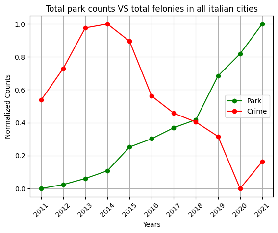
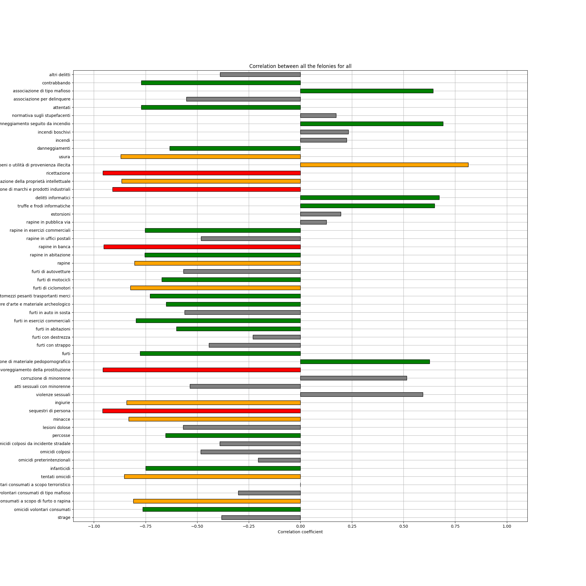

# Crime and Green Areas in Italian Cities: A Statistical Analysis

This project aims to analyze the statistical relationship between crime rates and the presence of parks or other green areas in Italian cities. The analysis is conducted using data from 2011 to 2021 for green areas and from 2004 to 2022 for crime statistics.

## Table of Contents
- [Project Overview](#project-overview)
- [Data Sources](#data-sources)
- [Dataset Descriptions](#dataset-descriptions)
  - [Park Data](#park-data)
  - [Crime Data](#crime-data)
- [Installation](#installation)
- [Repository Structure](#repository-structure)
- [Usage](#usage)
  - [Data Cleaning Script](#how-to-use-the-data_cleaningpy-script)
  - [Data Correlation Script](#how-to-use-the-data_correlationpy-script)
- [Results](#results)
- [Requirements](#requirements)
- [Contributing](#contributing)
- [License](#license)

## Project Overview
The goal of this project is to investigate if there is any correlation between the availability of parks and green areas and the crime rates in various Italian cities. The analysis is conducted using Python 3.10, with data visualization and statistical methods being employed to explore potential relationships.

## Data Sources
The raw datasets are downloaded from the [ISTAT website](http://dati.istat.it/Index.aspx). The park data covers the years from 2011 to 2021, while the crime data spans from 2004 to 2022.

## Dataset Descriptions

### Park Data

:four_leaf_clover: The file *VERDE_URBANO_2011_2021_ISTAT.xlsx* contains the data from 2011 to 2021. The data for capital municipalities includes:

- Planning tools (plan, regulation, census, ecological network)
- Monitoring according to Law 10/2013 (planting of new trees, tree balance, national tree day, development of green spaces, risk of tree collapse)
- Surfaces of publicly managed areas (by type of area with a revision of historical data series for the years 2011 to 2020)
- Natura 2000 network
- Protected natural areas
- Agricultural parks.

The park categories considered are:

- Verde storico (historic green spaces)
- Grandi parchi urbani (large urban parks)
- Verde attrezzato (equipped green spaces)
- Aree di arredo urbano (urban design areas)
- Forestazione pubblica (public afforestation)
- Giardini scolastici (school gardens)
- Orti botanici (botanical gardens)
- Orti urbani (urban gardens)
- Giardini zoologici (zoological gardens)
- Cimiteri (cemeteries)
- Aree sportive all'aperto (outdoor sports areas)
- Aree boschive (wooded areas)
- Verde incolto (uncultivated green spaces)
- Altro (other)

## Installation
To set up the project environment, clone this repository and install the required packages using the `requirements.txt` file. Make sure you have Python 3.10 installed.

```bash
git clone https://github.com/your-username/your-repo-name.git
cd your-repo-name
pip install -r requirements.txt
```

## Repository Structure
The repository is organized as follows:

```
├── notebook/
│   └── data_exploration.ipynb    # Notebook for data exploration
├── scripts/
│   ├── data_cleaning.py          # Script for cleaning raw datasets
│   ├── data_correlation.py       # Script for correlation analysis and statistical plotting
├── figures/                      # Folder containing plots produced by scripts
├── output/                       # Folder containing CSV files of correlation results
├── requirements.txt              # List of required packages for the project
└── README.md                     # Project documentation
```

### Folder Descriptions

- **notebook**: Contains the Jupyter notebook `data_exploration.ipynb` for exploring the park and crime datasets.
- **scripts**: Contains Python scripts:
  - `data_cleaning.py`: Script to clean and preprocess the raw datasets.
  - `data_correlation.py`: Script to estimate correlations between park data and crime rates and to produce statistical plots.
- **figures**: Stores all the plots generated by the `data_correlation.py` script.
- **output**: Contains CSV files with correlation results computed by the `data_correlation.py` script.

## Usage
1. **Data Exploration**: Start by exploring the datasets using the notebook in the `notebook` folder.
2. **Data Cleaning**: Run the `data_cleaning.py` script to clean and prepare the raw datasets.
3. **Correlation Analysis**: Use the `data_correlation.py` script to perform correlation analysis between the crime and park data, and generate plots for further investigation.
4. **Results**: View the generated plots in the `figures` folder and the correlation results in the `output` folder.

### How to Use the `data_cleaning.py` Script

The `data_cleaning.py` script is used to clean the raw datasets and produce the final CSV files that are used for the analysis. The script accepts the following arguments:

- `--dataset`: Specifies the dataset to clean. Choose between `"park"` or `"crime"`.
- `--savefile`: Specifies whether to save the cleaned file in the `output` directory. Choose between `"yes"` or `"no"` (default is `"no"`).

#### Example Usage:

To clean the park dataset and save the cleaned file:

```bash
python scripts/data_cleaning.py --dataset park --savefile yes
```

To clean the crime dataset without saving the cleaned file:

```bash
python scripts/data_cleaning.py --dataset crime --savefile no
```

### How to Use the `data_correlation.py` Script

The `data_correlation.py` script is used to study the statistical correlation between the park and crime datasets. The script provides various options to customize the analysis, including selecting specific cities, felonies, and park datasets. The script accepts the following arguments:

- `--city`: Specifies the city to consider for the correlation. (Default: `"default"`)
- `--felony`: Specifies the felony to consider for the correlation. (Default: `"default"`)
- `--park_path`: Path where the cleaned park datasets are stored. (Default: `"default"`)
- `--crime_path`: Path where the cleaned crime dataset is stored. (Default: `"default"`)
- `--path_out`: Path where the output files will be saved. (Default: `"default"`)
- `--park_dataset`: Specifies the type of park dataset to use. Choose between `"availability_m2"`, `"availability_m2_per_inhabitant"`, `"area_m2"`, `"area_density"`. (Default: `"availability_m2_per_inhabitant"`)
- `--park_city`: Specifies the city of the park dataset to consider. Use `"all"` to consider all provinces as one. (Default: `"all"`)
- `--crime_city`: Specifies the city of the crime dataset to consider. Use `"all"` to consider all provinces as one. (Default: `"all"`)
- `--crime_felony`: Specifies the felony of the crime dataset to consider. Use `"all"` to consider all felonies combined. (Default: `"all"`)
- `--normalization`: Specifies whether to apply min/max normalization to the data. Choose between `"yes"` or `"no"`. (Default: `"yes"`)
- `--save_corr`: Specifies whether to save the correlation file. Choose between `"yes"` or `"no"`. (Default: `"yes"`)
- `--load_corr`: Specifies whether to load a previously computed correlation file. Choose between `"yes"` or `"no"`. (Default: `"yes"`)
- `--corr_filename`: Specifies the name of the correlation output file. (Default: `"corr_df.csv"`)
- `--corr_fig_filename`: Specifies the name of the correlation figure. (Default: `"correlation"`)

#### Example Usage:

To perform a correlation analysis for a specific city and felony, and save the correlation results:

```bash
python scripts/data_correlation.py --city "Rome" --felony "theft" --park_path "data/park/" --crime_path "data/crime/" --path_out "output/" --save_corr yes
```

To load a previously computed correlation file and generate a plot:

```bash
python scripts/data_correlation.py --load_corr yes --corr_filename "output/corr_df.csv" --corr_fig_filename "output/correlation_plot.png"
```

### Crime Data

:hocho: The file *individuals_reported_and_arrested_or_detained_by_police_forces.csv* contains data from 2004 to 2022:

- Crimes reported to the judicial authority by the State Police, the Carabinieri, and the Guardia di Finanza.
- The data relates to the crimes and individuals reported by the police forces to the judicial authority.
- The data is derived from the operational activities of the police forces and does not follow the subsequent judicial process of the reported incidents.
- The number of reports referring to individuals reported does not exactly match the actual number of individuals reported. The same alleged perpetrator of a crime is counted each time they are reported in the considered year, for each crime committed.
- The sum of crimes distinguished by province may not match the total for the region, and the sum of the regions may not match the total for Italy, due to the lack of specification, for some crimes,

 of the place where they were committed (or the indication of the region where the crime was committed but not the province).

## Results

From the comparison of the counts of park distribution and crime (without distinguishing specific crime categories), it appears that when park counts increase over the years, crime counts generally decrease. However, it is important to consider that this observation could be coincidental, as crime rates have been trending downwards in recent years.  To confirm this behavior, it would be useful to analyze data from years prior to 2011.

The correlation plot (generated by the `data_correlation.py` script) shows that a significant portion of crime categories are negatively correlated with park counts across Italy.  This suggests that the presence of parks may be associated with lower crime rates, although further investigation is needed to establish causality. Also in this case it is important to stress that more detailed data about the park and green areas would be useful to exclude all those effects that can produce fake correlations between the data.

## Requirements
- Python 3.10
- All necessary packages are listed in the `requirements.txt` file.

## Contributing
Contributions are welcome! Please feel free to submit a pull request or open an issue if you have any suggestions or improvements.
